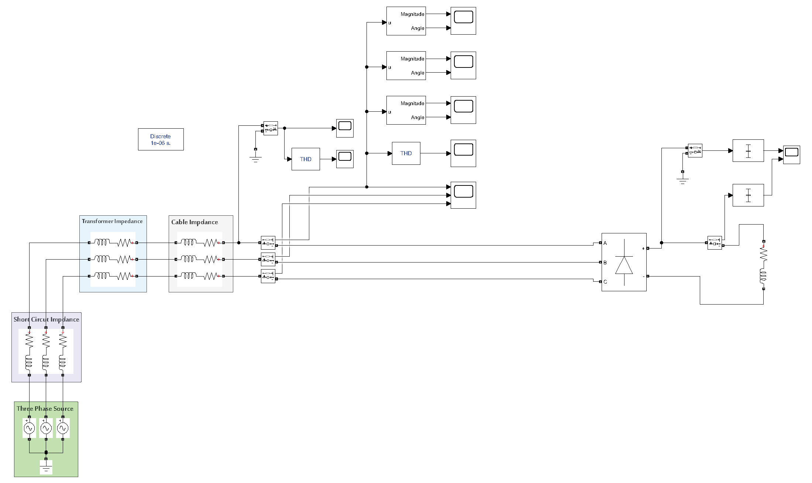
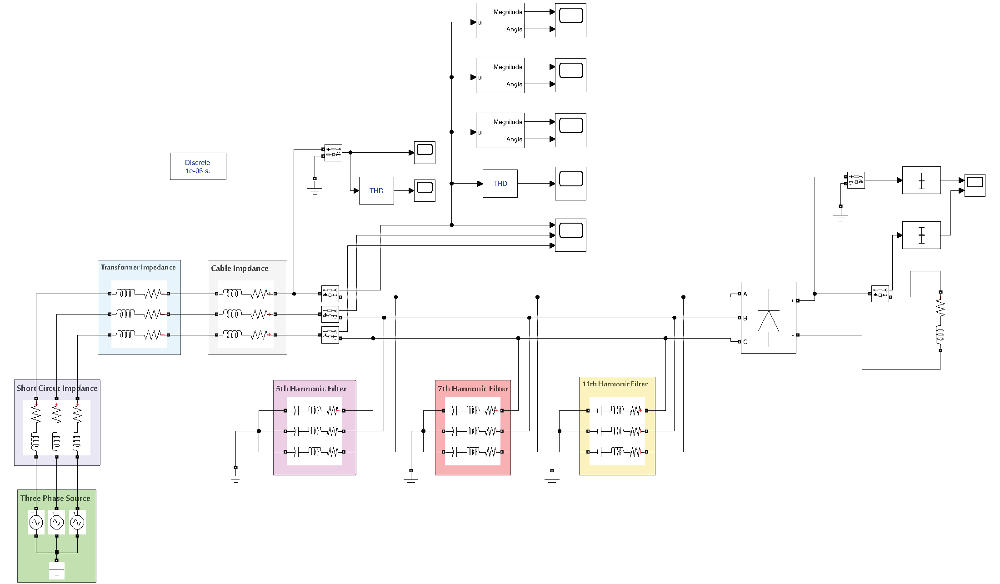
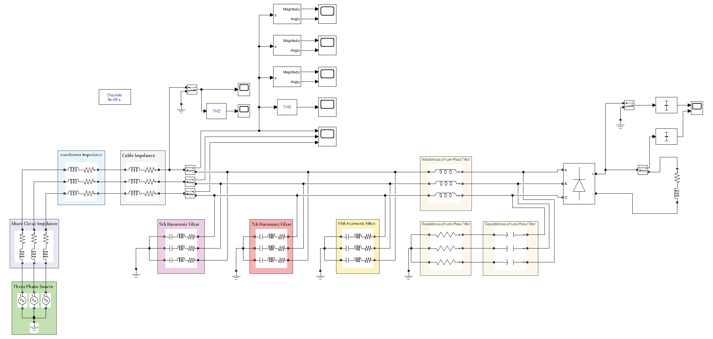
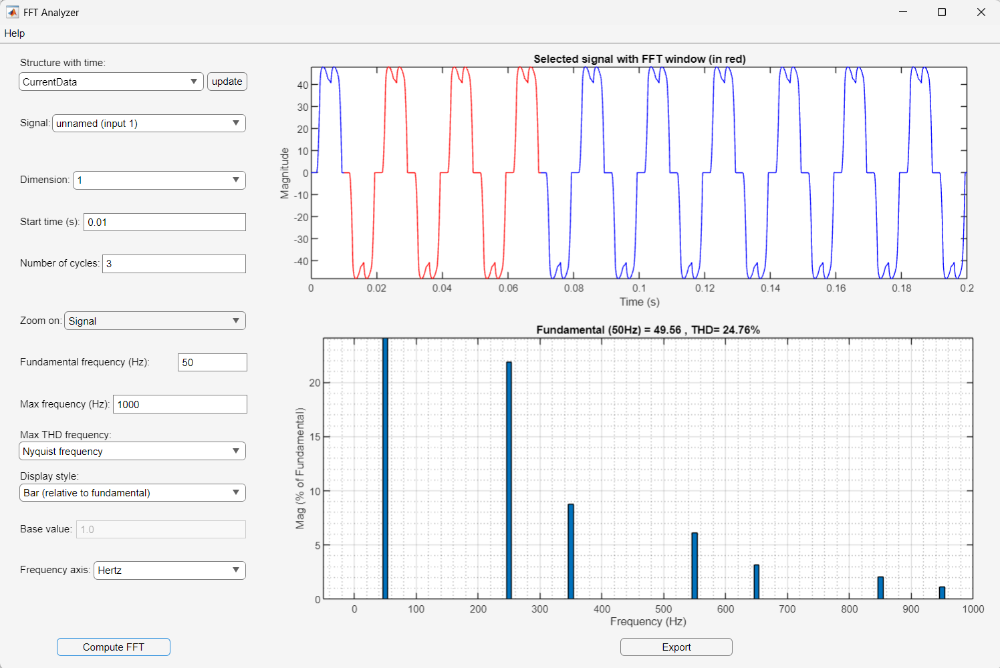
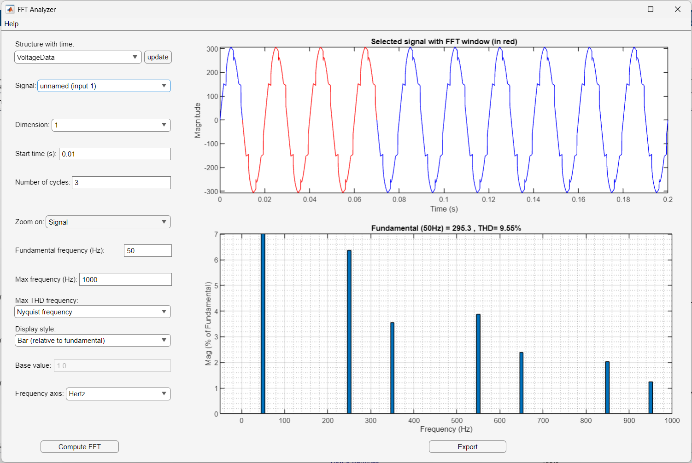
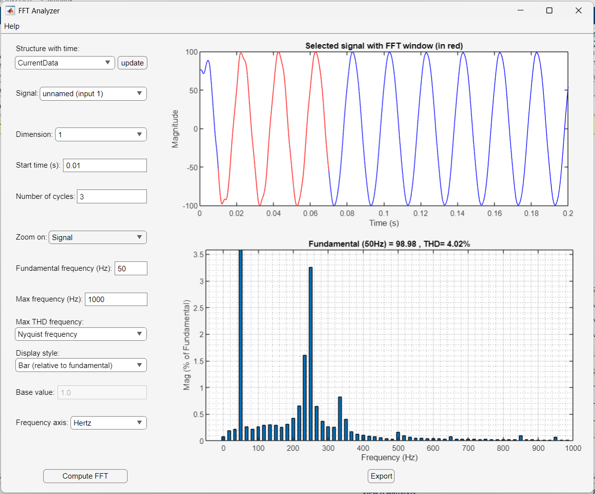
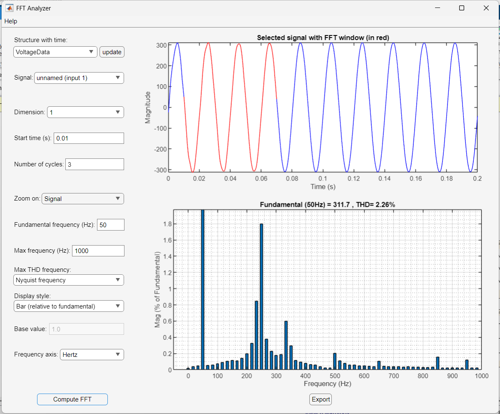

# Power Quality Improvement in an Electrical Grid Feeding Non-Linear Loads

This repository hosts the MATLAB/Simulink engineering project focused on analyzing and mitigating harmonic distortion in a three-phase power grid supplying non-linear loads. The project implements and compares two distinct filtering methodologies: **Multi-Stage Passive Tuned Filters (RLC)** and a **First-Order Passive Low-Pass Filter (LPF)** to suppress total harmonic distortion (THD) and ensure power quality compliance with international electrical standards.

## 1. Overview / Abstract
Modern electrical grids face severe power quality degradation due to the proliferation of non-linear power electronic loads, such as diode rectifiers, which generate high-order harmonic currents. This project presents a rigorous engineering study of harmonic mitigation within a simulated $400\text{ V}$, $50\text{ Hz}$ three-phase system feeding a $25\text{ kW}$ six-pulse diode bridge rectifier. Two passive filtering topologies—individual RLC series tuned resonance filters targeting the 5th, 7th, and 11th harmonic orders, and a comprehensive series-choke/shunt-RC passive low-pass filter—were modeled and analyzed in MATLAB/Simulink R2023b. The simulation results demonstrate a dramatic reduction in current Total Harmonic Distortion ($THD_I$) from $24.76\%$ to $9.93\%$ using multi-stage tuned filters, and down to $4.02\%$ using the optimized passive low-pass filter, bringing the system well within international compliance standards (e.g., IEEE 519 / IEC 61000).

## 2. Problem Statement
Non-linear loads draw current in non-sinusoidal pulses, injecting harmonic currents into the power distribution system. In this study, a three-phase $6$-pulse diode rectifier (representing typical industrial non-linear loads such as variable speed drives or DC power supplies) is connected to the grid. This non-linear operation causes severe current distortion ($THD_I = 24.76\%$) and significant voltage distortion ($THD_V = 9.55\%$) across the line cable and transformer impedances. 

Such harmonic levels lead to:
* **Overheating and premature aging** of power transformers and distribution cables due to increased copper losses ($I^2R$) and core losses (eddy currents).
* **Voltage drops and waveform distortion** that degrade the operational reliability of neighboring sensitive electronic equipment.
* **Resonance risks** with power factor correction capacitor banks, causing catastrophic overvoltage or overcurrent conditions.
* **Non-compliance** with global grid standards, which typically mandate $THD_V < 5\%$ and stringent limits on individual harmonic current injection.

## 3. Methodology & Software Used
### Software & Libraries
* **MATLAB® & Simulink® R2023b**: Used as the primary simulation environment.
* **Simscape™ Electrical™ (Specialized Power Systems Library)**: Utilized to model physical electrical components such as three-phase sources, line impedances, transformers, universal diode bridges, and passive filters.
* **FFT Analysis Tool (via `powergui` block)**: Used to conduct Fast Fourier Transform (FFT) analysis on recorded voltage and current waveforms to evaluate individual harmonic magnitudes and calculate Total Harmonic Distortion (THD).

### Simulation Settings
To ensure highly precise, physically realistic simulation results, the following parameters were configured:
* **Simulation Solver**: Set to **Discrete** mode (rather than continuous) via the `powergui` block to accurately handle the high-frequency switching and commutation of the diode rectifier elements.
* **Sample Time ($T_s$)**: Crucially defined at a very small value of $1 \times 10^{-6}\text{ s}$ ($1\ \mu\text{s}$) to capture high-frequency harmonic transients up to the Nyquist limit and prevent spectral aliasing errors.
* **Data Logging**: Scopes configured to log current (`CurrentData`) and voltage (`VoltageData`) signals directly to the MATLAB workspace in the `Structure with time` format, which is the native input format required by the Simulink FFT Analyzer tool.
* **Analysis Window**: Waveform analysis was set to initiate at $t = 0.01\text{ s}$ over $3$ complete cycles of the fundamental frequency ($50\text{ Hz}$) to allow transient startup dynamics to decay, ensuring steady-state harmonic analysis.

## 4. System Architecture & Design Details

### 4.1 Grid and Load Parameters
The modeled distribution system consists of a three-phase utility source feeding a six-pulse diode bridge rectifier through a short-circuit impedance, step-down transformer, and transmission cable. The detailed electrical parameters of the system components are outlined in the table below:

| System Component | Parameter Description | Symbol | Value |
| :--- | :--- | :--- | :--- |
| **Three-Phase Source** | Line-to-Line Nominal RMS Voltage | $V_{L-L}$ | $400\text{ V}$ |
| | Line-to-Neutral Peak Voltage (Simulink) | $V_{peak}$ | $220\sqrt{2}\text{ V}$ |
| | Fundamental Frequency | $f$ | $50\text{ Hz}$ |
| | Phase Shift (Phases A, B, C) | $\theta_s$ | $(0^\circ, -120^\circ, 120^\circ)$ |
| **Short-Circuit Impedance**| Short-Circuit Apparent Power | $S_{sc}$ | $500\text{ MVA}$ |
| | Source Resistance | $R_{sc}$ | $3.184 \times 10^{-3}\ \Omega$ |
| | Source Inductance | $L_{sc}$ | $1\text{ mH}$ |
| **Power Transformer** | Transformer Apparent Power | $S_T$ | $1000\text{ kVA}$ |
| | Series Resistance (referred to secondary)| $R_T$ | $2.08 \times 10^{-3}\ \Omega$ |
| | Series Inductance (referred to secondary) | $L_T$ | $3.05 \times 10^{-5}\text{ H}$ |
| **Transmission Cable** | Cable Length | $Length$ | $230\text{ m}$ |
| | Cross-Sectional Area (Copper) | $Area$ | $16\text{ mm}^2$ |
| | Cable Resistance | $R_{cable}$ | $0.256\ \Omega$ |
| | Cable Inductance | $L_{cable}$ | $6.05 \times 10^{-5}\text{ H}$ |
| **Non-Linear RL Load** | Active Power Consumed | $P_{load}$ | $25\text{ kW}$ |
| | Diode Rectifier Topology | - | 3-Phase 6-Pulse (Universal Bridge) |
| | DC-Side Load Resistance | $R_{load}$ | $10.6\ \Omega$ |
| | DC-Side Load Inductance | $L_{load}$ | $1\text{ mH}$ |

### 4.2 Task 1: Design of Passive Series Tuned Resonance Filters (RLC)
To absorb the dominant low-order harmonic currents generated by the $6$-pulse rectifier (specifically the 5th, 7th, and 11th harmonic orders), three parallel-connected, single-tuned series RLC filter branches were designed.

#### Design Methodology & Equations
The design process is governed by the following mathematical and physical formulations:
1. **Resonance Frequency ($f_r$)**: The filter must present a minimum impedance path at the target harmonic frequency $f_{r_n}$:
   $$f_{r_n} = n \times f = \frac{1}{2\pi \sqrt{L_n C_n}}$$
   where $n$ is the harmonic order (e.g., $n = 5, 7, 11$) and $f = 50\text{ Hz}$ is the fundamental frequency.

2. **Capacitance ($C$)**: The capacitance is calculated for reactive power compensation to maintain a high power factor and is held constant across all three filter stages:
   $$C = 3.339 \times 10^{-5}\text{ F} \quad (33.39\ \mu\text{F})$$

3. **Inductance ($L_n$)**: Derived from the resonance relation for each harmonic order $n$:
   $$L_n = \frac{1}{(2\pi f_{r_n})^2 \times C}$$

4. **Damping Resistance ($r_n$)**: Derived using the defined Quality Factor ($Q = 75$), which optimizes the filtering bandwidth and tuning sharpness:
   $$r_n = \frac{X_0}{Q} = \frac{\sqrt{L_n / C}}{Q}$$

#### Summary of RLC Tuned Filter Parameters
Using these equations, the calculated parameters entered into the Simulink RLC branches are summarized below:

| Harmonic Order ($n$) | Resonance Frequency ($f_{r_n}$) | Inductance ($L_n$) | Capacitance ($C_n$) | Resistance ($r_n$) |
| :---: | :---: | :---: | :---: | :---: |
| **5th Harmonic** | $250\text{ Hz}$ | $0.0121\text{ H}\ (12.1\text{ mH})$ | $3.339 \times 10^{-5}\text{ F}$ | $0.253\ \Omega$ |
| **7th Harmonic** | $350\text{ Hz}$ | $0.00619\text{ H}\ (6.19\text{ mH})$ | $3.339 \times 10^{-5}\text{ F}$ | $0.1815\ \Omega$ |
| **11th Harmonic**| $550\text{ Hz}$ | $0.0025\text{ H}\ (2.5\text{ mH})$ | $3.339 \times 10^{-5}\text{ F}$ | $0.115\ \Omega$ |

### 4.3 Task 2: Design of Passive Low-Pass Filter (LPF)
As an alternative to tuning multiple separate narrow-band RLC filters, a single, first-order passive low-pass filter (LPF) was designed to establish a broad attenuation band. This topology dampens all higher frequency components above a designated cutoff frequency.

#### LPF Design Topology & Parameters
The LPF configuration comprises:
1. **Three Series Line Choke Inductors ($L_{LPF}$)**: Placed in series on each phase line to provide high impedance against high frequencies.
2. **Shunt RC Branches (Star/Wye Connected to Ground)**: Placed after the series inductors to divert high-frequency harmonic currents safely to the ground.

#### Mathematical Design Formulations
1. **Resonance/Cutoff Frequency ($f_{r_{LPF}}$)**: Chosen as $150\text{ Hz}$ to allow the $50\text{ Hz}$ fundamental power to pass with zero attenuation, while significantly suppressing the 5th ($250\text{ Hz}$) and all subsequent higher-order harmonics:
   $$f_{r_{LPF}} = 150\text{ Hz}$$

2. **Series Inductance ($L$)**: Selected as a fixed baseline value:
   $$L = 2\text{ mH} = 0.002\text{ H}$$

3. **Shunt Capacitance ($C$)**: Calculated using the resonance formula:
   $$C = \frac{1}{(2\pi f_{r_{LPF}})^2 \cdot L} = \frac{1}{(2\pi \times 150)^2 \times 0.002} \approx 5.629 \times 10^{-4}\text{ F} \quad (562.9\ \mu\text{F})$$

4. **Damping Resistance ($R$)**: To avoid resonant peaks near the cutoff frequency and ensure grid stability, a low quality factor $Q = 3$ is selected. The damping resistor $R$ is calculated as:
   $$X_C = \frac{1}{2\pi f_{r_{LPF}} \cdot C} \approx 1.885\ \Omega$$
   $$R = \frac{X_C}{Q} = \frac{1.885}{3} \approx 0.628\ \Omega$$

| LPF Component | Parameter | Design Value |
| :--- | :--- | :--- |
| **Series Inductors (Choke)** | Phase Inductance ($L$) | $2\text{ mH}\ (0.002\text{ H})$ |
| **Shunt Capacitors** | Phase Capacitance ($C$) | $562.9\ \mu\text{F}\ (562.9 \times 10^{-6}\text{ F})$ |
| **Damping Resistors** | Phase Resistance ($R$) | $0.628\ \Omega$ |

## 5. Simulation Results & Performance Analysis

The power quality improvement was tracked step-by-step through Fast Fourier Transform (FFT) analysis. The table below compiles the definitive current and voltage Total Harmonic Distortion (THD) values across the different stages of the simulation.

### THD Mitigation Summary

| Simulation Scenario | Current THD ($THD_I$) | Voltage THD ($THD_V$) | Compliance Status (e.g., IEEE 519 / IEC) |
| :--- | :---: | :---: | :---: |
| **1. Unfiltered Original System** | $24.76\%$ | $9.55\%$ | **Violates Standards** (High distortion) |
| **2. With 5th Harmonic Filter Only** | $14.83\%$ | $7.27\%$ | Incomplete mitigation |
| **3. With 5th & 7th Harmonic Filters** | $11.94\%$ | $6.35\%$ | High residual high-order harmonics |
| **4. With 5th, 7th & 11th Harmonic Filters**| $9.93\%$ | $4.76\%$ | **Marginal Compliance** ($THD_V < 5\%$) |
| **5. With Low-Pass Filter (LPF)** | **$4.02\%$** | **$2.26\%$** | **Highly Compliant** (Excellent performance) |

### 5.1 Graphical FFT Waveform Analysis

#### Stage A: Unfiltered Waveforms
Without filters, the current waveform resembles a standard, highly distorted double-peaked profile characteristic of three-phase diode bridges. The voltage waveform experiences significant notches and flat-topping.
* $THD_I = 24.76\%$ (Fundamental Current = $49.56\text{ A}$)

* $THD_V = 9.55\%$ (Fundamental Voltage = $295.3\text{ V}$)

#### Stage B: Multi-Stage Tuned Filters Integration
As filters are added in parallel, the targeted harmonic currents are diverted, smoothing the waveforms incrementally:
1. **5th Filter Added:** Diverts the 5th harmonic peak ($250\text{ Hz}$). The current THD drops to $14.83\%$ and voltage THD to $7.27\%$.
2. **7th Filter Added:** Further eliminates the 7th harmonic peak ($350\text{ Hz}$). Current THD decreases to $11.94\%$ and voltage THD to $6.35\%$.
3. **11th Filter Added:** Eliminates the 11th harmonic peak ($550\text{ Hz}$). The current waveform approaches a sinusoidal shape, achieving $THD_I = 9.93\%$, and the voltage THD drops to $4.76\%$, meeting the general grid voltage THD requirement of being below $5\%$.

#### Stage C: Integrated Passive Low-Pass Filter
The LPF demonstrates outstanding performance. By setting the cutoff frequency to $150\text{ Hz}$, it acts as a global block to all high-frequency currents. The current waveform is reshaped into a highly smooth, near-perfect sine wave.
* $THD_I = 4.02\%$ (Fundamental Current = $98.98\text{ A}$)

* $THD_V = 2.26\%$ (Fundamental Voltage = $311.7\text{ V}$)

This represents the most effective solution in terms of THD reduction, stabilizing the system and bringing both voltage and current distortion levels well below standard limits.

## 6. Engineering Comparative Discussion
While both filtering approaches improve the system's power quality, they exhibit different engineering trade-offs:

1. **Passive Tuned Filters (Task 1)**:
   * **Pros**: Highly selective; they specifically target and eliminate the most severe low-order harmonics (5th, 7th, 11th) without heavily affecting other frequencies; they also provide reactive power compensation at fundamental frequency ($50\text{ Hz}$) because of their capacitive component, helping to improve the overall system power factor.
   * **Cons**: Require multiple bulky LC branches, which increases installation space and material costs. They are highly sensitive to component aging or grid frequency variations, which can cause de-tuning and significantly degrade performance.
   
2. **Passive Low-Pass Filter (Task 2)**:
   * **Pros**: Provides a broad band of attenuation, successfully eliminating not only the 5th, 7th, and 11th harmonics but all subsequent high-frequency components and commutation noise. It achieved a much superior THD mitigation ($THD_I = 4.02\%$ and $THD_V = 2.26\%$) in this study.
   * **Cons**: Requires series line inductors (chokes) rated for the full line current, which introduces continuous, albeit small, voltage drops and ohmic losses. In addition, the massive shunt capacitors ($562.9\ \mu\text{F}$) draw significant leading reactive currents under light loads, which must be managed to prevent grid overvoltage.

## 7. Conclusion & Future Work
This engineering project successfully modeled a three-phase power network feeding a non-linear load and verified two classical methods for harmonic mitigation. While parallel tuned resonance filters (5th, 7th, and 11th orders) successfully reduced $THD_V$ below the $5\%$ grid limit, the first-order passive low-pass filter with a resonance cutoff at $150\text{ Hz}$ provided the highest power quality improvement, reducing current distortion to a highly compliant $4.02\%$ and voltage distortion to $2.26\%$.

### Future Work & Extensions
To further advance this research, the following paths are proposed:
* **Active Power Filters (APFs)**: Implementing shunt active power filters based on voltage-source inverters (VSI) and instantaneous reactive power theory (p-q theory) or d-q synchronous reference frame to dynamically inject compensating currents, adapting to variable load conditions.
* **Hybrid Filter Topologies**: Combining small-rated active power filters with passive tuned branches to minimize both capital cost and total harmonic distortion.
* **Optimization Algorithms for Parameter Tuning**: Utilizing Genetic Algorithms (GA) or Particle Swarm Optimization (PSO) to optimize the passive filter parameters ($R, L, C$) for multiple objectives, such as minimum cost, minimum voltage drop, and lowest THD.

## 8. Authors and Credits
* **Student**: Mohammad Ali Qattan
* **Supervisor**: Eng. Bayan Akkad
* **Academic Institution**: University of Aleppo, Department of Electrical Power Systems (Academic Year: May 2026)
